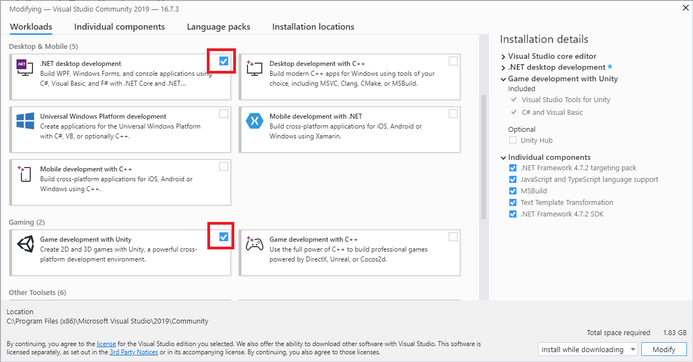

:::warning
From here on, nothing in this guide is official, this is just the only support that Volcanoids can offer for modding at the moment. However, while creating mods and this guide, the usage and code was explained to us during our close work with Ondrej. Tomas has also been a huge support for us, without their, and Rich's help, none of this would have been possible.
:::

:::note
There is one tool that many consider crucial for modding Unity games. It's called ILSpy. We have done most of the digging for you all to create this guide & SDK, but feel free to use it if you want a closer look at how the game is coded. The file to open in it is `Assembly-CSharp.dll`. I will be discussing how and where this file is in a later guide.
:::

## Visual Studio
Visual Studio is the tool of choice for this project, this is because of it's features for Unity known as Unity Debugging. I promise this will be a huge help for everyone here soon, for now we will be leaving debugging out of the full guide. If you truly want to use debugging you can find it [here](/coding/officialGuide/Debugging). Now as for installing Visual Studio you can find the download link [here](https://visualstudio.microsoft.com/downloads/) as well as the packages in the image below. As of writing this guide the packages are for Visual Studio 2019, I will only update this if a ground breaking change occurs in the next 3-5 versions.

## Volcanoids
I feel like this one's a given, however to ensure it's done correctly, the Volcanoids version is the one corresponding to the Version tag at the top of any of these documents. The entire wiki does get updated with each new Volcanoids release, however it may take a few days unless Tomas is kind enough to let us get them early!

## Unity
Well this one is very very optional. Really you only need this if you are a designer for now. However I'll save that for the designer guide. For now you do not need it for modding Volcanoids along these guides.

:::tip
I will put a warning on any guides that might need Unity right at the top. So if you see it and don't want to get Unity, skip that guide :)
:::

## Global Requirements
Look, I'm gonna get this out of the way now, I am not here to teach you C#, as such I will not be teaching C# syntax, however I might explain how some certain things such as C# reflection work when we use them. Other than that you need to have at least a basic understanding of C#. However there will be repositories on GitHub with code examples so if your really just want to change values... Well copy from those. 
Next up you need to understand Volcanoids. If you don't know what Volcanoids does or how it functions then I can't help you mod. I'm not here to be mean I'm just being honest. If you don't know your stuff, you can't mod a game, unfortunately that's just how it works. 

Now that all of that is out of the way, It's time for the basic structure before we get into full on guides.